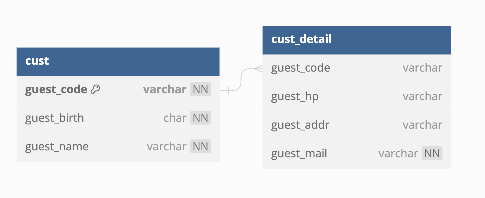

# 2023_08 씨큐프라임 개발분야 지원 [김선희_30]

## 구현 스택

#### Express.js, MySQL, EJS, AWS EC2, PM2, NGINX

## 애플리케이션의 실행 방법

- 테스트 URL : http://sunhee.duckdns.org/

1. cust, cust_detail 전체 목록 조회
   - http://sunhee.duckdns.org:3000
2. cust, cust_detail 특정 데이터 조회
   - http://sunhee.duckdns.org:3000/:guest_code
3. "STEP_02 "에서 제시된 데이터 파싱 후 파싱한 Data DB에 저장 ("처음으로" 버튼 클릭 시 DB 업데이트)
   - http://sunhee.duckdns.org:3000/update
4. 특정 데이터 수정
   - http://sunhee.duckdns.org:3000/:guest_code
5. 특정 데이터 삭제
   - http://sunhee.duckdns.org:3000/:guest_code

## 데이터베이스 테이블 구조

## 구현 내용

- EJS를 이용한 서버 사이드 렌더링 구현
- 목록 조회 페이지(src/views/index.ejs)와 수정 페이지(src/views/update.ejs)로 구성
- 수정 기능 구현 시 body값에 Joi를 이용하여 validation 적용, 예상치 못한 값 유입을 방지
- 데이터 무결성을 유지하기 위해 연속되는 쿼리 작업에 트랜잭션 적용
- deploy.sh 스크립트 파일을 작성하여 재배포 과정 자동화
- AWS EC2와 PM2, NGINX를 사용하여 안정적인 데이터베이스 및 백엔드 서버 구성
